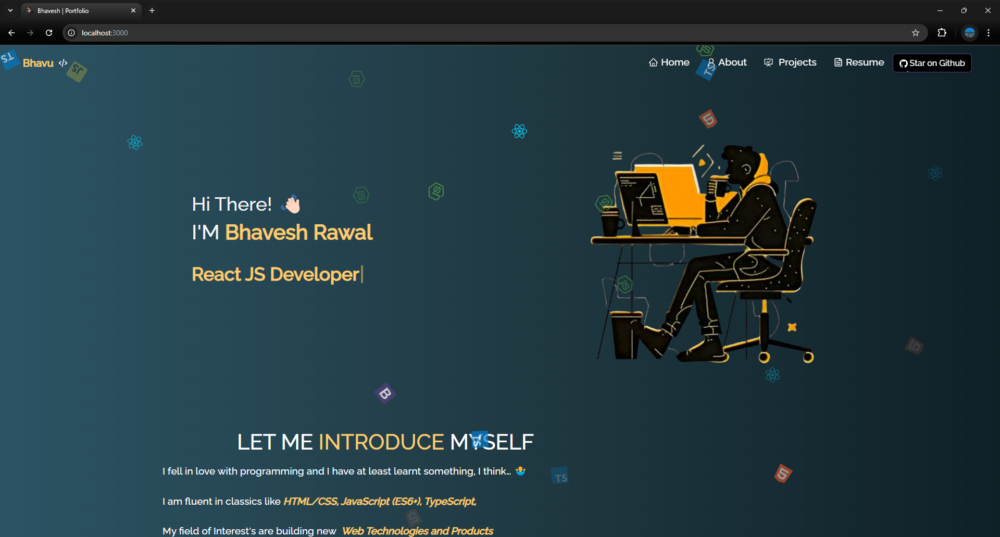

<h2 align="center">
  Portfolio Website - Bhavesh Rawal 
  <a href="https://portfolio-bhavesh.vercel.app/" target="_blank">portfolio-bhavesh</a>
</h2>
 

  

 

 &nbsp;
 &nbsp;

## Built With

My personal portfolio <a href="https://bhavesh-portfolio-gamma.vercel.app/" target="_blank">bhavesh-portfolio</a> which features some of my github projects as well as my resume and technical skills. 

This project was built using these technologies.

- React.js
- CSS3
- VsCode
- Vercel

## Features

**📖 Multi-Page Layout**

**🎨 Styled with React-Bootstrap and Css with easy to customize colors**

**📱 Fully Responsive**

## 🛠 Installation and Setup Instructions

1. Installation: `npm install`

2. In the project directory, you can run: `npm start`

Runs the app in the development mode.\
Open [http://localhost:3000](http://localhost:3000) to view it in the browser.
The page will reload if you make edits.
